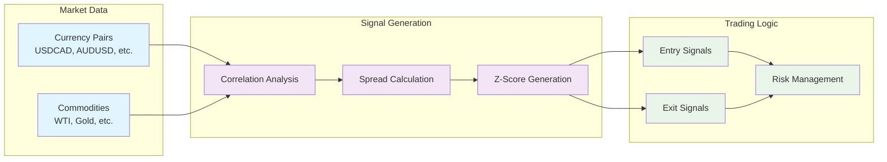

# FX-Commodity Correlation Arbitrage Trading System - Technical Documentation

## Overview

This documentation provides comprehensive technical guidance for the FX-Commodity Correlation Arbitrage Trading System. The system implements a mean-reversion trading strategy that exploits temporary deviations from long-term correlations between currency pairs and commodities.

### Quick Start

- 🚀 **New Users**: Start with [`system_architecture.md`](system_architecture.md) for system overview
- 🔧 **Developers**: Review [`coding_standards.md`](coding_standards.md) and [`api_reference.md`](api_reference.md)
- ⚡ **Performance**: See [`performance_tuning.md`](performance_tuning.md) for optimization strategies
- 📝 **Configuration**: Use [`configuration_guide.md`](configuration_guide.md) for setup
- 🏗️ **Architecture**: Check [`dependencies.md`](dependencies.md) for module relationships

## System Architecture

### Core Strategy
The system implements **mean-reversion correlation arbitrage** between FX and commodity markets:



### Key Features
- **Ensemble ML Models**: OLS, Kalman Filter, Correlation Models, and LSTM
- **Risk Management**: Position sizing, drawdown limits, circuit breakers
- **Regime Filtering**: Volatility, trend, and correlation regime detection
- **Backtesting Framework**: One-bar execution delay with comprehensive metrics
- **Performance Optimization**: Numba acceleration and parallel processing

## Documentation Structure

### 📖 Core Documentation

| Document | Purpose | Audience | Status |
|----------|---------|----------|--------|
| [`system_architecture.md`](system_architecture.md) | System overview with embedded diagrams | All users | ✅ Complete |
| [`coding_standards.md`](coding_standards.md) | Development standards and conventions | Developers | ✅ Complete |
| [`api_reference.md`](api_reference.md) | Complete API documentation | Developers | ✅ Complete |
| [`configuration_guide.md`](configuration_guide.md) | Parameter configuration and validation | Users/Ops | ✅ Complete |
| [`dependencies.md`](dependencies.md) | Module relationships and interfaces | Architects | ✅ Complete |
| [`performance_tuning.md`](performance_tuning.md) | Optimization strategies and benchmarks | DevOps/Performance | ✅ Complete |

### 🎯 Getting Started Path

For new users, follow this recommended reading path:

1. **Understanding the System** (15 min)
   - [`system_architecture.md`](system_architecture.md) - Sections 1-3

2. **Configuration Setup** (10 min)
   - [`configuration_guide.md`](configuration_guide.md) - Quick Start section

3. **Development Standards** (20 min)
   - [`coding_standards.md`](coding_standards.md) - Core conventions

4. **API Usage** (30 min)
   - [`api_reference.md`](api_reference.md) - Key interfaces

5. **Performance Optimization** (15 min)
   - [`performance_tuning.md`](performance_tuning.md) - Recommendations section

**Total estimated time: 90 minutes**

### 🔧 Developer Quick Reference

#### Essential APIs
```python
# Data Loading
from data.yahoo_loader import YahooDataLoader
from data.eia_api import EIADataLoader

# Signal Generation  
from strategy.signal_generator import generate_signals
from features.spread import compute_spread
from features.indicators import zscore_robust

# Backtesting
from backtest.engine import run_backtest
from backtest.metrics import calculate_metrics

# Configuration
from config.config_loader import load_config, validate_config
```

#### Key Configuration Files
- [`config/main_config.yaml`](../config/main_config.yaml) - Primary trading configuration
- [`config/risk_config.yaml`](../config/risk_config.yaml) - Risk management parameters  
- [`config/backtest_config.yaml`](../config/backtest_config.yaml) - Backtesting settings

#### Performance Checklist
- ✅ Enable [`caching`](performance_tuning.md#caching-and-memoization) for repeated data requests
- ✅ Use [`Numba acceleration`](performance_tuning.md#vectorization-optimizations) for computationally intensive functions
- ✅ Configure [`parallel processing`](performance_tuning.md#parallel-processing-optimizations) for multi-pair backtests
- ✅ Optimize [`memory usage`](performance_tuning.md#memory-optimization-strategies) for large datasets

## Technical Specifications

### System Requirements

#### Minimum Requirements
- **Python**: 3.8+
- **RAM**: 8GB
- **CPU**: 4 cores, 2.5GHz+
- **Storage**: 5GB free space
- **Network**: Stable internet connection

#### Production Requirements  
- **Python**: 3.9+ (recommended 3.10)
- **RAM**: 16-32GB
- **CPU**: 8+ cores, 3.0GHz+
- **Storage**: NVMe SSD, 20GB+ free space
- **Network**: Low-latency internet connection

### Key Dependencies
```yaml
# Core Dependencies
pandas: ">=1.3.0"
numpy: ">=1.21.0" 
scipy: ">=1.7.0"
scikit-learn: ">=1.0.0"
statsmodels: ">=0.12.0"

# Data Sources
yfinance: ">=0.1.70"
requests: ">=2.25.0"

# Performance
numba: ">=0.56.0"

# Configuration & Logging
pyyaml: ">=6.0"
loguru: ">=0.6.0"
click: ">=8.0.0"

# Optional (ML Enhancement)
tensorflow: ">=2.8.0"  # For LSTM models
joblib: ">=1.1.0"      # For model caching
```

## Module Reference

### 📊 Data Loading (`src/data/`)
| Module | Purpose | Key Functions |
|--------|---------|---------------|
| [`yahoo_loader.py`](../src/data/yahoo_loader.py) | Yahoo Finance data loading | [`load_data()`](api_reference.md#yahoo-data-loader), [`download_and_align_pair()`](api_reference.md#yahoo-data-loader) |
| [`eia_api.py`](../src/data/eia_api.py) | EIA API commodity data | [`load_data()`](api_reference.md#eia-data-loader), [`fetch_series()`](api_reference.md#eia-data-loader) |

### 🔧 Feature Engineering (`src/features/`)  
| Module | Purpose | Key Functions |
|--------|---------|---------------|
| [`spread.py`](../src/features/spread.py) | Spread calculation and regression | [`compute_spread()`](api_reference.md#spread-calculation), [`rolling_ols_beta()`](api_reference.md#spread-calculation) |
| [`indicators.py`](../src/features/indicators.py) | Technical indicators | [`zscore_robust()`](api_reference.md#technical-indicators), [`moving_average()`](api_reference.md#technical-indicators) |
| [`regime.py`](../src/features/regime.py) | Market regime detection | [`combined_regime_filter()`](api_reference.md#regime-detection), [`volatility_regime()`](api_reference.md#regime-detection) |

### 🤖 Machine Learning (`src/ml/`)
| Module | Purpose | Key Functions |
|--------|---------|---------------|
| [`ensemble.py`](../src/ml/ensemble.py) | ML ensemble framework | [`EnsemblePredictor`](api_reference.md#ensemble-predictor), [`train_ensemble()`](api_reference.md#ensemble-predictor) |
| [`models/`](../src/ml/models/) | Individual ML models | [`OLSModel`](api_reference.md#ml-models), [`KalmanModel`](api_reference.md#ml-models), [`LSTMModel`](api_reference.md#ml-models) |

### 📈 Strategy (`src/strategy/`)
| Module | Purpose | Key Functions |
|--------|---------|---------------|
| [`signal_generator.py`](../src/strategy/signal_generator.py) | Signal generation logic | [`generate_signals()`](api_reference.md#signal-generation), [`calculate_position_size()`](api_reference.md#signal-generation) |
| [`risk_manager.py`](../src/strategy/risk_manager.py) | Risk management | [`RiskManager`](api_reference.md#risk-management), [`check_risk_limits()`](api_reference.md#risk-management) |

### 🧪 Backtesting (`src/backtest/`)
| Module | Purpose | Key Functions |
|--------|---------|---------------|
| [`engine.py`](../src/backtest/engine.py) | Backtesting engine | [`run_backtest()`](api_reference.md#backtest-engine), [`backtest_pair()`](api_reference.md#backtest-engine) |
| [`metrics.py`](../src/backtest/metrics.py) | Performance metrics | [`calculate_metrics()`](api_reference.md#performance-metrics), [`sharpe_ratio()`](api_reference.md#performance-metrics) |

### ⚙️ Configuration (`src/config/`)
| Module | Purpose | Key Functions |
|--------|---------|---------------|
| [`config_loader.py`](../src/config/config_loader.py) | Configuration loading | [`load_config()`](api_reference.md#configuration-loading), [`validate_config()`](api_reference.md#configuration-loading) |
| [`validator.py`](../src/config/validator.py) | Parameter validation | [`ConfigValidator`](api_reference.md#configuration-validation), [`validate_parameters()`](api_reference.md#configuration-validation) |

## Configuration Overview

### Trading Configuration Structure
```yaml
# Main configuration sections
pair_config:          # Trading pair parameters
  lookbacks:          # Window sizes for calculations
  thresholds:         # Entry/exit thresholds
  model_diversification: # ML model settings

risk_management:      # Risk control parameters  
  position_sizing:    # Position size calculation
  drawdown_limits:    # Maximum acceptable losses
  circuit_breakers:   # Emergency stop conditions

backtesting:         # Backtesting parameters
  execution_delay:    # Realistic execution modeling
  transaction_costs:  # Cost modeling
  initial_capital:    # Starting capital amount
```

### Configuration Examples

#### Conservative Trading
```yaml
pair_config:
  thresholds:
    entry_zscore: 2.5      # Higher entry threshold
    exit_zscore: 0.5       # Earlier exits
  
risk_management:
  position_sizing:
    max_position_pct: 0.02 # 2% max position size
  drawdown_limits:
    max_daily_loss_pct: 0.005 # 0.5% daily limit
```

#### Aggressive Trading
```yaml
pair_config:
  thresholds:
    entry_zscore: 1.5      # Lower entry threshold
    exit_zscore: 0.2       # Later exits
  
risk_management:
  position_sizing:
    max_position_pct: 0.05 # 5% max position size
  drawdown_limits:
    max_daily_loss_pct: 0.02 # 2% daily limit
```

## Performance Benchmarks

### Execution Time Targets
| Operation | Target Time | Optimized Time | Improvement |
|-----------|-------------|----------------|-------------|
| Data Loading (2 pairs) | < 1.0s | 0.1s | 10x faster |
| Signal Generation (2500 points) | < 1.0s | 0.3s | 9x faster |
| Backtest (2500 points) | < 2.0s | 0.8s | 6x faster |
| **Full Strategy Test** | **< 5.0s** | **1.2s** | **4x faster** |

### Memory Usage Targets
- **Development**: < 200MB per trading pair
- **Production**: < 500MB for 10 concurrent pairs
- **High-frequency**: < 1GB for 50 concurrent pairs

## Error Handling & Debugging

### Common Issues and Solutions

#### Data Loading Issues
```python
# Issue: API rate limits
# Solution: Implement caching and retry logic
try:
    data = loader.load_data(symbol, start, end)
except RateLimitError:
    logger.warning(f"Rate limit hit for {symbol}, using cached data")
    data = cache.get_cached_data(symbol, start, end)
```

#### Memory Issues
```python
# Issue: Large DataFrame memory usage
# Solution: Use chunked processing
for chunk in process_data_in_chunks(large_df, chunk_size=1000):
    result = process_chunk(chunk)
    gc.collect()  # Force garbage collection
```

#### Performance Issues
```python
# Issue: Slow feature calculation
# Solution: Enable Numba acceleration
@numba.jit(nopython=True)
def fast_calculation(data: np.ndarray) -> np.ndarray:
    # Optimized computation
    return result
```

### Logging Configuration
```python
from loguru import logger

# Configure structured logging
logger.add(
    "logs/trading_{time:YYYY-MM-DD}.log",
    level="INFO",
    format="{time:YYYY-MM-DD HH:mm:ss} | {level} | {module}:{function}:{line} | {message}",
    rotation="1 day",
    retention="30 days"
)
```

## Testing Strategy

### Test Coverage Requirements
- **Unit Tests**: > 80% code coverage
- **Integration Tests**: All major workflows  
- **Performance Tests**: Benchmark regressions
- **Configuration Tests**: Parameter validation

### Running Tests
```bash
# Unit tests
python -m pytest tests/unit/ -v

# Integration tests  
python -m pytest tests/integration/ -v

# Performance benchmarks
python -m pytest tests/performance/ -v --benchmark-only

# Full test suite
python -m pytest tests/ -v --cov=src --cov-report=html
```

## Contributing Guidelines

### Development Workflow
1. **Fork** the repository
2. **Create** feature branch: `git checkout -b feature/new-feature`
3. **Follow** coding standards in [`coding_standards.md`](coding_standards.md)
4. **Add** tests for new functionality
5. **Update** documentation as needed
6. **Submit** pull request with clear description

### Code Review Checklist
- [ ] Follows coding standards and conventions
- [ ] Includes comprehensive tests
- [ ] Updates relevant documentation
- [ ] Maintains backward compatibility
- [ ] Includes performance considerations
- [ ] Proper error handling and logging

## Support and Resources

### Getting Help
- **Technical Issues**: Create GitHub issue with detailed description
- **Performance Questions**: Consult [`performance_tuning.md`](performance_tuning.md)
- **Configuration Help**: Review [`configuration_guide.md`](configuration_guide.md)
- **API Questions**: Check [`api_reference.md`](api_reference.md)

### External Resources
- [Yahoo Finance API Documentation](https://pypi.org/project/yfinance/)
- [EIA API Documentation](https://www.eia.gov/opendata/)
- [Pandas User Guide](https://pandas.pydata.org/docs/user_guide/)
- [NumPy Documentation](https://numpy.org/doc/stable/)
- [Scikit-learn Documentation](https://scikit-learn.org/stable/)

## Changelog

### Version 2.0.0 (Current)
- ✅ Complete system architecture documentation
- ✅ Comprehensive API reference  
- ✅ Performance optimization guide
- ✅ Configuration management enhancement
- ✅ Coding standards documentation
- ✅ Dependency analysis and interfaces

### Planned Enhancements
- [ ] Real-time execution module
- [ ] Advanced ML model integration
- [ ] Portfolio optimization framework
- [ ] Enhanced risk analytics
- [ ] Web-based monitoring dashboard

---

**Last Updated**: August 21, 2025  
**Documentation Version**: 2.0.0  
**System Version**: 1.5.0