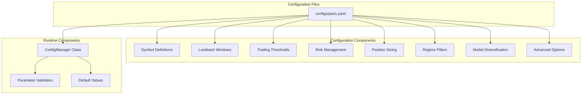
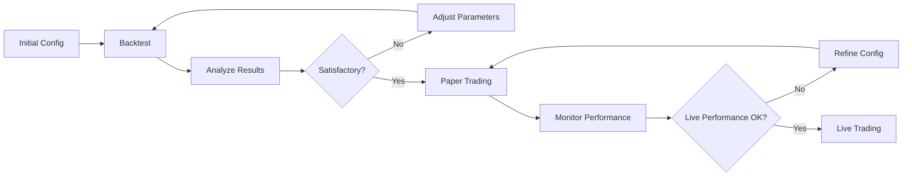

# FX-Commodity Correlation Arbitrage - Configuration Guide

## Overview

This document provides comprehensive guidance for configuring the FX-Commodity Correlation Arbitrage trading system. The system uses YAML-based configuration files to define trading parameters, risk limits, and operational settings.

## Configuration Architecture

The system follows a hierarchical configuration structure:



## Configuration File Structure

### Main Configuration File: `configs/pairs.yaml`

```yaml
# Trading pair configuration
pair_name:
  # Symbol definitions
  fx_symbol: str           # Required
  comd_symbol: str         # Required
  comd: str               # Required
  inverse_fx_for_quote_ccy_strength: bool  # Required
  
  # Performance metrics
  min_trade_count: int     # Optional, default: 10
  
  # Rolling metrics configuration
  rolling_metrics:         # Optional
    windows:
      "30D": int
      "60D": int
      "90D": int
  
  # Lookback windows
  lookbacks:              # Required
    beta_window: int      # Required
    z_window: int         # Required
    corr_window: int      # Required
    lookback: int         # Optional, default: 252
    vol_window: int       # Optional, default: 20
  
  # Trading thresholds
  thresholds:             # Required
    entry_z: float        # Required
    exit_z: float         # Required
    stop_z: float         # Required
    adf_p: float          # Optional, default: 0.05
    min_abs_corr: float   # Optional, default: 0.3
  
  # Time-based stops
  time_stop:              # Optional
    max_days: int         # Optional, default: 10
  
  # Regime filtering
  regime:                 # Optional
    min_abs_corr: float
    volatility_window: int
    high_vol_threshold: float
    low_vol_threshold: float
    filter_extreme_vol: bool
    trend_window: int
    trend_threshold: float
    filter_strong_trend: bool
  
  # Regime features (advanced)
  regime_features:        # Optional
    volatility_regime: bool
    commodity_cycle: bool
    vix_overlay: bool
    yield_curve_overlay: bool
    vpa: bool
    liquidity_sweep: bool
    trend_filters: bool
    correlation_features: bool
  
  # Position sizing
  sizing:                 # Required
    atr_window: int       # Required
    target_vol_per_leg: float  # Required
    profit_target: float  # Optional, default: 2.0
    stop_loss: float      # Optional, default: 1.5
    volatility_scaling_enabled: bool  # Optional, default: true
    target_volatility: float  # Optional, default: 0.01
    max_position_size: float  # Optional, default: 0.10
  
  # Risk management
  risk:                   # Required
    max_position_size: float      # Required
    max_daily_loss: float         # Required
    max_weekly_loss: float        # Required
    daily_drawdown_limit: float   # Required
    max_trade_risk: float         # Required
    enable_circuit_breaker: bool  # Required
  
  # Advanced options
  use_kalman: bool        # Optional, default: true
  
  # Model diversification
  model_diversification:  # Optional
    enable_ensemble: bool
    enable_ols: bool
    enable_kalman_model: bool
    enable_correlation_model: bool
    enable_gb_model: bool
    enable_lstm_model: bool
    model_weights:
      ols: float
      kalman: float
      corr: float
      gb: float
      lstm: float
  
  # Event calendar
  calendar:               # Optional
    event_blackouts: list  # Optional, default: []
```

## Parameter Reference

### Symbol Definitions

#### fx_symbol
- **Type**: String
- **Required**: Yes
- **Description**: Yahoo Finance symbol for the FX pair
- **Valid Values**: Any valid Yahoo Finance FX symbol
- **Examples**: 
  - `"USDCAD=X"` - USD/CAD exchange rate
  - `"USDNOK=X"` - USD/NOK exchange rate
  - `"EURUSD=X"` - EUR/USD exchange rate
- **Validation**: Must be non-empty string ending with "=X" for FX pairs

#### comd_symbol
- **Type**: String
- **Required**: Yes
- **Description**: Yahoo Finance symbol for the commodity
- **Valid Values**: Any valid Yahoo Finance commodity symbol
- **Examples**:
  - `"CL=F"` - WTI Crude Oil Futures
  - `"BZ=F"` - Brent Crude Oil Futures
  - `"GC=F"` - Gold Futures
- **Validation**: Must be non-empty string ending with "=F" for futures

#### comd
- **Type**: String
- **Required**: Yes
- **Description**: Human-readable commodity identifier
- **Valid Values**: Short commodity name
- **Examples**: `"WTI"`, `"BRENT"`, `"GOLD"`
- **Validation**: Must be non-empty string, typically uppercase

#### inverse_fx_for_quote_ccy_strength
- **Type**: Boolean
- **Required**: Yes
- **Description**: Whether to inverse the FX rate for quote currency strength analysis
- **Valid Values**: `true`, `false`
- **Usage**: Set to `true` for USD/XXX pairs to analyze XXX currency strength
- **Example**: `true` for USD/CAD to analyze CAD strength vs oil

### Performance Metrics

#### min_trade_count
- **Type**: Integer
- **Required**: No
- **Default**: 10
- **Description**: Minimum number of trades required for meaningful annualized metrics
- **Valid Range**: 1 to 1000
- **Recommendation**: Use 10+ for reliable statistics
- **Impact**: Affects when annualized metrics are calculated vs. simple returns

### Rolling Metrics Configuration

#### rolling_metrics.windows
- **Type**: Dictionary
- **Required**: No
- **Description**: Rolling window configurations for performance metrics
- **Structure**:
  ```yaml
  windows:
    "30D": 30    # 30-day rolling metrics
    "60D": 60    # 60-day rolling metrics
    "90D": 90    # 90-day rolling metrics
  ```
- **Valid Values**: Any positive integer for window sizes
- **Usage**: Enables calculation of rolling Sharpe, Sortino, and drawdown metrics

### Lookback Windows

#### lookbacks.beta_window
- **Type**: Integer
- **Required**: Yes
- **Description**: Rolling window size for dynamic hedge ratio (beta) calculation
- **Valid Range**: 20 to 500
- **Recommendation**: 60-120 for most pairs
- **Impact**: 
  - Larger values: More stable hedge ratios, slower adaptation
  - Smaller values: More responsive, potentially noisier
- **Example**: `90` provides good balance of stability and responsiveness

#### lookbacks.z_window
- **Type**: Integer
- **Required**: Yes
- **Description**: Rolling window size for z-score calculation
- **Valid Range**: 10 to 200
- **Recommendation**: 20-60 for most applications
- **Impact**:
  - Larger values: Smoother signals, fewer false signals
  - Smaller values: More responsive to regime changes
- **Example**: `40` for moderate responsiveness

#### lookbacks.corr_window
- **Type**: Integer
- **Required**: Yes
- **Description**: Rolling window for correlation calculation in regime filtering
- **Valid Range**: 10 to 100
- **Recommendation**: 20-40 for most pairs
- **Impact**: Affects sensitivity of correlation-based regime filter
- **Example**: `20` for responsive correlation tracking

#### lookbacks.lookback
- **Type**: Integer
- **Required**: No
- **Default**: 252
- **Description**: General lookback period for various calculations
- **Valid Range**: 100 to 1000
- **Recommendation**: 252 (one trading year) for most applications
- **Usage**: Used in secondary calculations and validations

#### lookbacks.vol_window
- **Type**: Integer
- **Required**: No
- **Default**: 20
- **Description**: Window for volatility calculations
- **Valid Range**: 5 to 100
- **Recommendation**: 20 for daily volatility, 5-10 for intraday
- **Usage**: Used in position sizing and risk calculations

### Trading Thresholds

#### thresholds.entry_z
- **Type**: Float
- **Required**: Yes
- **Description**: Z-score threshold for entering trades
- **Valid Range**: 0.5 to 5.0
- **Recommendation**: 1.0-2.0 for most pairs
- **Impact**:
  - Higher values: Fewer trades, potentially higher win rate
  - Lower values: More trades, potentially lower win rate
- **Example**: `1.5` for moderate entry criteria
- **Validation**: Must be greater than `exit_z`

#### thresholds.exit_z
- **Type**: Float
- **Required**: Yes
- **Description**: Z-score threshold for exiting profitable trades
- **Valid Range**: 0.1 to 3.0
- **Recommendation**: 0.3-1.0 for most applications
- **Impact**:
  - Higher values: Hold trades longer, larger profits/losses
  - Lower values: Quick exits, smaller profits/losses
- **Example**: `0.5` for moderate exit timing
- **Validation**: Must be less than `entry_z` and less than `stop_z`

#### thresholds.stop_z
- **Type**: Float
- **Required**: Yes
- **Description**: Z-score threshold for stop-loss exits
- **Valid Range**: 1.0 to 10.0
- **Recommendation**: 2.5-4.0 for most pairs
- **Impact**: Wider stops allow more time for mean reversion
- **Example**: `3.5` for generous stop-loss
- **Validation**: Must be greater than `entry_z`

#### thresholds.adf_p
- **Type**: Float
- **Required**: No
- **Default**: 0.05
- **Description**: P-value threshold for Augmented Dickey-Fuller stationarity test
- **Valid Range**: 0.01 to 0.20
- **Recommendation**: 0.05-0.10 for most applications
- **Usage**: Used in cointegration-based regime filtering
- **Interpretation**: Lower values require stronger evidence of stationarity

#### thresholds.min_abs_corr
- **Type**: Float
- **Required**: No
- **Default**: 0.3
- **Description**: Minimum absolute correlation threshold for trading
- **Valid Range**: 0.1 to 0.9
- **Recommendation**: 0.2-0.4 for most pairs
- **Impact**: Higher values trade only during strong correlation periods
- **Example**: `0.25` for moderately permissive correlation filtering

### Time-Based Controls

#### time_stop.max_days
- **Type**: Integer
- **Required**: No
- **Default**: 10
- **Description**: Maximum number of days to hold a position
- **Valid Range**: 1 to 100
- **Recommendation**: 5-20 for mean-reversion strategies
- **Impact**: Prevents positions from being held indefinitely
- **Usage**: Automatic position closure after specified days

### Regime Filtering Parameters

#### regime.min_abs_corr
- **Type**: Float
- **Required**: No
- **Description**: Minimum absolute correlation for regime filter
- **Valid Range**: 0.0 to 1.0
- **Recommendation**: 0.15-0.30
- **Usage**: More permissive than `thresholds.min_abs_corr` for regime detection

#### regime.volatility_window
- **Type**: Integer
- **Required**: No
- **Default**: 20
- **Description**: Window for volatility regime detection
- **Valid Range**: 5 to 100
- **Recommendation**: 20 for daily data
- **Usage**: Calculates rolling volatility for regime classification

#### regime.high_vol_threshold
- **Type**: Float
- **Required**: No
- **Default**: 0.02
- **Description**: Threshold for high volatility regime (2%)
- **Valid Range**: 0.01 to 0.10
- **Recommendation**: 0.015-0.025 for most FX pairs
- **Usage**: Volatility above this level triggers high-vol regime

#### regime.low_vol_threshold
- **Type**: Float
- **Required**: No
- **Default**: 0.003
- **Description**: Threshold for low volatility regime (0.3%)
- **Valid Range**: 0.001 to 0.010
- **Recommendation**: 0.002-0.005 for most FX pairs
- **Usage**: Volatility below this level triggers low-vol regime

#### regime.filter_extreme_vol
- **Type**: Boolean
- **Required**: No
- **Default**: true
- **Description**: Whether to filter out extreme volatility periods
- **Recommendation**: `true` for most applications
- **Impact**: Prevents trading during market stress periods

#### regime.trend_window
- **Type**: Integer
- **Required**: No
- **Default**: 20
- **Description**: Window for trend strength calculation
- **Valid Range**: 5 to 100
- **Recommendation**: 20 for daily data
- **Usage**: Calculates trend magnitude for filtering

#### regime.trend_threshold
- **Type**: Float
- **Required**: No
- **Default**: 0.015
- **Description**: Threshold for strong trend detection (1.5%)
- **Valid Range**: 0.005 to 0.050
- **Recommendation**: 0.010-0.020 for most pairs
- **Usage**: Trend above this level may filter out mean-reversion trades

#### regime.filter_strong_trend
- **Type**: Boolean
- **Required**: No
- **Default**: true
- **Description**: Whether to filter out strong trending periods
- **Recommendation**: `true` for mean-reversion strategies
- **Impact**: Prevents counter-trend trading during strong trends

### Regime Features (Advanced)

#### regime_features.volatility_regime
- **Type**: Boolean
- **Required**: No
- **Default**: true
- **Description**: Enable volatility-based regime detection
- **Usage**: Incorporates volatility state in trading decisions

#### regime_features.commodity_cycle
- **Type**: Boolean
- **Required**: No
- **Default**: true
- **Description**: Enable commodity cycle analysis
- **Usage**: Considers commodity seasonality and cycles

#### regime_features.vix_overlay
- **Type**: Boolean
- **Required**: No
- **Default**: true
- **Description**: Enable VIX-based market sentiment overlay
- **Usage**: Incorporates broader market fear/greed sentiment

#### regime_features.yield_curve_overlay
- **Type**: Boolean
- **Required**: No
- **Default**: false
- **Description**: Enable yield curve analysis overlay
- **Usage**: Advanced macro-economic regime detection

#### regime_features.vpa (Volume Price Analysis)
- **Type**: Boolean
- **Required**: No
- **Default**: true
- **Description**: Enable volume price analysis features
- **Usage**: Incorporates volume patterns in signal generation

#### regime_features.liquidity_sweep
- **Type**: Boolean
- **Required**: No
- **Default**: true
- **Description**: Enable liquidity sweep detection
- **Usage**: Identifies and filters market manipulation patterns

#### regime_features.trend_filters
- **Type**: Boolean
- **Required**: No
- **Default**: true
- **Description**: Enable advanced trend filtering
- **Usage**: Multi-timeframe trend analysis

#### regime_features.correlation_features
- **Type**: Boolean
- **Required**: No
- **Default**: true
- **Description**: Enable advanced correlation features
- **Usage**: Dynamic correlation analysis and regime detection

### Position Sizing Parameters

#### sizing.atr_window
- **Type**: Integer
- **Required**: Yes
- **Description**: Window for Average True Range calculation
- **Valid Range**: 5 to 100
- **Recommendation**: 14-20 for most applications
- **Usage**: Used in position sizing and risk calculations
- **Example**: `20` for daily ATR calculation

#### sizing.target_vol_per_leg
- **Type**: Float
- **Required**: Yes
- **Description**: Target volatility per leg of the trade (as decimal)
- **Valid Range**: 0.001 to 0.100
- **Recommendation**: 0.005-0.015 (0.5%-1.5%) for most strategies
- **Example**: `0.01` for 1% target volatility per leg
- **Usage**: Base for inverse volatility position sizing

#### sizing.profit_target
- **Type**: Float
- **Required**: No
- **Default**: 2.0
- **Description**: Profit target as multiple of ATR
- **Valid Range**: 1.0 to 10.0
- **Recommendation**: 1.5-3.0 for mean-reversion
- **Example**: `2.0` means take profit at 2x ATR move
- **Usage**: Dynamic profit-taking levels

#### sizing.stop_loss
- **Type**: Float
- **Required**: No
- **Default**: 1.5
- **Description**: Stop loss as multiple of ATR
- **Valid Range**: 0.5 to 5.0
- **Recommendation**: 1.0-2.0 for mean-reversion
- **Example**: `1.5` means stop loss at 1.5x ATR adverse move
- **Usage**: Dynamic stop-loss levels

#### sizing.volatility_scaling_enabled
- **Type**: Boolean
- **Required**: No
- **Default**: true
- **Description**: Enable volatility-based position scaling
- **Recommendation**: `true` for adaptive position sizing
- **Usage**: Reduces position sizes during high volatility periods

#### sizing.target_volatility
- **Type**: Float
- **Required**: No
- **Default**: 0.01
- **Description**: Overall target portfolio volatility (as decimal)
- **Valid Range**: 0.005 to 0.050
- **Recommendation**: 0.008-0.020 for most strategies
- **Usage**: Portfolio-level risk targeting

#### sizing.max_position_size
- **Type**: Float
- **Required**: No
- **Default**: 0.10
- **Description**: Maximum position size as fraction of equity
- **Valid Range**: 0.01 to 0.50
- **Recommendation**: 0.05-0.15 for most strategies
- **Example**: `0.10` means maximum 10% of equity per position
- **Usage**: Position size cap for risk control

### Risk Management Parameters

#### risk.max_position_size
- **Type**: Float
- **Required**: Yes
- **Description**: Maximum position size as fraction of equity per pair
- **Valid Range**: 0.01 to 0.50
- **Recommendation**: 0.05-0.20 depending on strategy aggressiveness
- **Example**: `0.10` allows maximum 10% equity exposure per pair
- **Validation**: Should be reasonable fraction of total capital

#### risk.max_daily_loss
- **Type**: Float
- **Required**: Yes
- **Description**: Maximum daily loss as fraction of equity per pair
- **Valid Range**: 0.005 to 0.100
- **Recommendation**: 0.01-0.03 (1%-3%) for most strategies
- **Example**: `0.02` stops trading at 2% daily loss
- **Usage**: Daily loss circuit breaker

#### risk.max_weekly_loss
- **Type**: Float
- **Required**: Yes
- **Description**: Maximum weekly loss as fraction of equity per pair
- **Valid Range**: 0.02 to 0.200
- **Recommendation**: 0.03-0.08 (3%-8%) for most strategies
- **Example**: `0.05` stops trading at 5% weekly loss
- **Usage**: Weekly loss circuit breaker

#### risk.daily_drawdown_limit
- **Type**: Float
- **Required**: Yes
- **Description**: Maximum daily drawdown as fraction of equity
- **Valid Range**: 0.005 to 0.100
- **Recommendation**: 0.015-0.030 for most strategies
- **Example**: `0.02` stops trading at 2% daily drawdown
- **Usage**: Intraday drawdown protection

#### risk.max_trade_risk
- **Type**: Float
- **Required**: Yes
- **Description**: Maximum risk per individual trade as fraction of equity
- **Valid Range**: 0.002 to 0.050
- **Recommendation**: 0.005-0.020 (0.5%-2%) for most strategies
- **Example**: `0.01` limits individual trade risk to 1%
- **Usage**: Per-trade risk cap

#### risk.enable_circuit_breaker
- **Type**: Boolean
- **Required**: Yes
- **Description**: Enable circuit breaker system for risk limits
- **Recommendation**: `true` for all production trading
- **Usage**: Automatically stops trading when risk limits breached
- **Impact**: Critical safety mechanism

### Advanced Options

#### use_kalman
- **Type**: Boolean
- **Required**: No
- **Default**: true
- **Description**: Use Kalman filter (RLS) for dynamic hedge ratio calculation
- **Alternative**: Uses rolling OLS if `false`
- **Recommendation**: `true` for better adaptive capability
- **Impact**: 
  - `true`: More responsive to changing relationships
  - `false`: More stable, less adaptive

### Model Diversification

#### model_diversification.enable_ensemble
- **Type**: Boolean
- **Required**: No
- **Default**: false
- **Description**: Enable ensemble model predictions
- **Usage**: Combines multiple models for signal generation
- **Requirements**: Requires ML dependencies (scikit-learn, torch)

#### model_diversification.enable_ols
- **Type**: Boolean
- **Required**: No
- **Default**: true
- **Description**: Enable Ordinary Least Squares model in ensemble
- **Usage**: Traditional linear regression approach

#### model_diversification.enable_kalman_model
- **Type**: Boolean
- **Required**: No
- **Default**: true
- **Description**: Enable Kalman filter model in ensemble
- **Usage**: Adaptive filtering approach

#### model_diversification.enable_correlation_model
- **Type**: Boolean
- **Required**: No
- **Default**: true
- **Description**: Enable correlation-based model in ensemble
- **Usage**: Rolling correlation approach

#### model_diversification.enable_gb_model
- **Type**: Boolean
- **Required**: No
- **Default**: false
- **Description**: Enable Gradient Boosting model in ensemble
- **Requirements**: Requires scikit-learn
- **Usage**: Non-linear machine learning approach

#### model_diversification.enable_lstm_model
- **Type**: Boolean
- **Required**: No
- **Default**: false
- **Description**: Enable LSTM neural network model
- **Requirements**: Requires PyTorch
- **Usage**: Deep learning sequence modeling

#### model_diversification.model_weights
- **Type**: Dictionary
- **Required**: No (if ensemble enabled)
- **Description**: Weights for combining ensemble model predictions
- **Structure**:
  ```yaml
  model_weights:
    ols: 0.2      # 20% weight for OLS
    kalman: 0.2   # 20% weight for Kalman
    corr: 0.2     # 20% weight for correlation
    gb: 0.2       # 20% weight for gradient boosting
    lstm: 0.2     # 20% weight for LSTM
  ```
- **Validation**: Weights should sum to 1.0
- **Recommendation**: Equal weights (0.2 each) for initial testing

### Event Calendar

#### calendar.event_blackouts
- **Type**: List
- **Required**: No
- **Default**: []
- **Description**: List of event types to avoid trading around
- **Valid Values**: Event type strings
- **Examples**: 
  ```yaml
  event_blackouts:
    - "FOMC_MEETING"
    - "NFP_RELEASE" 
    - "CPI_RELEASE"
    - "OPEC_MEETING"
  ```
- **Usage**: Prevents trading during high-impact news events

## Configuration Examples

### Conservative Configuration

```yaml
usdcad_wti_conservative:
  # Symbol definitions
  fx_symbol: "USDCAD=X"
  comd_symbol: "CL=F"
  comd: "WTI"
  inverse_fx_for_quote_ccy_strength: true
  
  # Conservative lookbacks - longer windows for stability
  lookbacks:
    beta_window: 120    # Longer for stable hedge ratio
    z_window: 60        # Longer for smoother signals
    corr_window: 40     # Longer for stable correlation
  
  # Conservative thresholds - higher entry, wider stops
  thresholds:
    entry_z: 2.0        # Higher entry threshold
    exit_z: 0.8         # Conservative exits
    stop_z: 4.0         # Wide stops
    min_abs_corr: 0.4   # Strong correlation required
  
  # Conservative time stop
  time_stop:
    max_days: 15        # Longer holding period
  
  # Conservative position sizing
  sizing:
    atr_window: 20
    target_vol_per_leg: 0.008  # Lower volatility target
    volatility_scaling_enabled: true
    max_position_size: 0.08    # Smaller positions
  
  # Conservative risk limits
  risk:
    max_position_size: 0.08    # 8% maximum
    max_daily_loss: 0.015      # 1.5% daily limit
    max_weekly_loss: 0.04      # 4% weekly limit
    daily_drawdown_limit: 0.015
    max_trade_risk: 0.008      # 0.8% per trade
    enable_circuit_breaker: true
```

### Aggressive Configuration

```yaml
usdcad_wti_aggressive:
  # Symbol definitions
  fx_symbol: "USDCAD=X"
  comd_symbol: "CL=F"
  comd: "WTI"
  inverse_fx_for_quote_ccy_strength: true
  
  # Aggressive lookbacks - shorter windows for responsiveness
  lookbacks:
    beta_window: 60     # Shorter for responsive hedge ratio
    z_window: 20        # Shorter for quick signals
    corr_window: 15     # Shorter for responsive correlation
  
  # Aggressive thresholds - lower entry, tighter stops
  thresholds:
    entry_z: 1.2        # Lower entry threshold
    exit_z: 0.4         # Quick exits
    stop_z: 2.8         # Tighter stops
    min_abs_corr: 0.2   # More permissive correlation
  
  # Aggressive time stop
  time_stop:
    max_days: 8         # Shorter holding period
  
  # Aggressive position sizing
  sizing:
    atr_window: 14
    target_vol_per_leg: 0.015  # Higher volatility target
    volatility_scaling_enabled: true
    max_position_size: 0.15    # Larger positions
  
  # Aggressive risk limits
  risk:
    max_position_size: 0.15    # 15% maximum
    max_daily_loss: 0.025      # 2.5% daily limit
    max_weekly_loss: 0.06      # 6% weekly limit  
    daily_drawdown_limit: 0.025
    max_trade_risk: 0.015      # 1.5% per trade
    enable_circuit_breaker: true
```

### High-Frequency Configuration

```yaml
usdcad_wti_highfreq:
  # Symbol definitions
  fx_symbol: "USDCAD=X"
  comd_symbol: "CL=F"
  comd: "WTI"
  inverse_fx_for_quote_ccy_strength: true
  
  # High-frequency lookbacks
  lookbacks:
    beta_window: 40     # Very short for maximum responsiveness
    z_window: 15        # Very short for quick signals
    corr_window: 10     # Very short correlation window
  
  # High-frequency thresholds
  thresholds:
    entry_z: 0.8        # Very low entry threshold
    exit_z: 0.2         # Very quick exits
    stop_z: 2.0         # Tight stops
    min_abs_corr: 0.15  # Very permissive correlation
  
  # High-frequency time stop
  time_stop:
    max_days: 3         # Very short holding period
  
  # High-frequency position sizing
  sizing:
    atr_window: 10
    target_vol_per_leg: 0.005  # Lower vol per trade, more trades
    volatility_scaling_enabled: true
    max_position_size: 0.08    # Moderate position size
  
  # Tight risk controls for high frequency
  risk:
    max_position_size: 0.08
    max_daily_loss: 0.01       # 1% daily limit
    max_weekly_loss: 0.03      # 3% weekly limit
    daily_drawdown_limit: 0.01
    max_trade_risk: 0.005      # 0.5% per trade
    enable_circuit_breaker: true
```

## Configuration Validation

### Automatic Validation Rules

The system automatically validates configurations with these rules:

#### Threshold Validation
```python
# Automatic validation checks
assert entry_z > exit_z, "Entry Z must be greater than Exit Z"
assert stop_z > entry_z, "Stop Z must be greater than Entry Z"  
assert min_abs_corr >= 0.0 and min_abs_corr <= 1.0, "Correlation must be between 0 and 1"
```

#### Window Validation
```python
# Window size validation
assert beta_window >= 20, "Beta window too small for reliable estimation"
assert z_window >= 10, "Z-score window too small"
assert beta_window <= 500, "Beta window too large, may be outdated"
```

#### Risk Validation
```python
# Risk parameter validation
assert max_position_size <= 0.5, "Position size exceeds 50% of equity"
assert max_daily_loss <= 0.1, "Daily loss limit exceeds 10%"
assert max_trade_risk <= max_daily_loss, "Trade risk exceeds daily limit"
```

### Custom Validation Functions

```python
def validate_pair_config(config: Dict[str, Any]) -> List[str]:
    """
    Validate pair configuration and return list of warnings/errors.
    
    Returns:
        List of validation messages (empty if valid)
    """
    warnings = []
    
    # Validate symbol format
    if not config["fx_symbol"].endswith("=X"):
        warnings.append("FX symbol should end with '=X' for Yahoo Finance")
    
    if not config["comd_symbol"].endswith("=F"):
        warnings.append("Commodity symbol should end with '=F' for futures")
    
    # Validate parameter relationships
    if config["thresholds"]["entry_z"] <= config["thresholds"]["exit_z"]:
        warnings.append("Entry Z should be greater than Exit Z")
    
    # Validate risk parameters
    total_risk = (config["risk"]["max_position_size"] * 
                  len(config.get("pairs", [config])))
    if total_risk > 1.0:
        warnings.append("Total position risk exceeds 100% of equity")
    
    return warnings
```

## Configuration Best Practices

### 1. Parameter Selection Guidelines

**Lookback Windows**:
- Start with medium windows (60/20/20 for beta/z/corr)
- Increase for stability, decrease for responsiveness
- Consider data frequency and pair characteristics

**Thresholds**:
- Start with moderate thresholds (1.5/0.5/3.0 for entry/exit/stop)
- Adjust based on backtesting results
- Consider transaction costs in threshold selection

**Risk Limits**:
- Never exceed 20% position size per pair
- Set daily limits at 2-3% maximum
- Use circuit breakers in all configurations

### 2. Configuration Testing Workflow



### 3. Environment-Specific Configurations

**Development Environment**:
```yaml
# Conservative settings for testing
lookbacks:
  beta_window: 90
  z_window: 30
risk:
  max_position_size: 0.05  # Very small positions
  enable_circuit_breaker: true
```

**Paper Trading Environment**:
```yaml
# Realistic settings matching intended live config
lookbacks:
  beta_window: 60
  z_window: 20
risk:
  max_position_size: 0.10  # Production-like sizing
  enable_circuit_breaker: true
```

**Live Trading Environment**:
```yaml
# Production settings with extra safety
risk:
  enable_circuit_breaker: true
  max_position_size: 0.08  # Slightly conservative vs paper
  daily_drawdown_limit: 0.015  # Tighter than paper
```

### 4. Multi-Pair Configuration Management

When trading multiple pairs, consider:

**Portfolio-Level Risk**:
```yaml
# Ensure total exposure doesn't exceed limits
pair1:
  risk:
    max_position_size: 0.08  # 8% per pair
pair2:
  risk:
    max_position_size: 0.08  # 8% per pair
# Total potential exposure: 16%
```

**Correlation Between Pairs**:
```yaml
# Reduce position sizes for correlated pairs
usdcad_wti:
  risk:
    max_position_size: 0.10
usdnok_brent:  # Correlated with above
  risk:
    max_position_size: 0.06  # Reduced due to correlation
```

## Troubleshooting Configuration Issues

### Common Configuration Problems

#### Problem: No Trading Activity
**Symptoms**: Backtest shows no trades generated
**Possible Causes**:
- `entry_z` threshold too high
- `min_abs_corr` threshold too high  
- Regime filters too restrictive
- Insufficient data quality

**Solutions**:
```yaml
# More permissive settings
thresholds:
  entry_z: 1.0        # Reduce from higher value
  min_abs_corr: 0.2   # Reduce from higher value
regime:
  filter_extreme_vol: false  # Temporarily disable
```

#### Problem: Too Many Trades
**Symptoms**: Excessive trading frequency, high transaction costs
**Possible Causes**:
- `entry_z` threshold too low
- `exit_z` threshold too low
- Windows too short

**Solutions**:
```yaml
# More selective settings
thresholds:
  entry_z: 2.0        # Increase threshold
  exit_z: 0.8         # Increase exit threshold
lookbacks:
  z_window: 40        # Increase for stability
```

#### Problem: Large Drawdowns
**Symptoms**: Unacceptable drawdown levels
**Possible Causes**:
- `stop_z` threshold too wide
- Position sizes too large
- Risk limits too permissive

**Solutions**:
```yaml
# Tighter risk controls
thresholds:
  stop_z: 2.5         # Reduce from higher value
risk:
  max_position_size: 0.05  # Reduce position sizes
  daily_drawdown_limit: 0.01  # Tighter drawdown control
```

### Configuration Validation Script

```python
def validate_configuration(config_path: str) -> bool:
    """
    Comprehensive configuration validation script.
    
    Args:
        config_path: Path to configuration file
        
    Returns:
        True if configuration is valid
    """
    try:
        with open(config_path, 'r') as f:
            config = yaml.safe_load(f)
        
        errors = []
        warnings = []
        
        for pair_name, pair_config in config.items():
            # Validate each pair
            pair_warnings = validate_pair_config(pair_config)
            warnings.extend([f"{pair_name}: {w}" for w in pair_warnings])
        
        # Print results
        if errors:
            print("ERRORS:")
            for error in errors:
                print(f"  - {error}")
            return False
        
        if warnings:
            print("WARNINGS:")
            for warning in warnings:
                print(f"  - {warning}")
        
        print("Configuration validation completed successfully")
        return True
        
    except Exception as e:
        print(f"Configuration validation failed: {e}")
        return False

# Usage
if __name__ == "__main__":
    validate_configuration("configs/pairs.yaml")
```

This comprehensive configuration guide provides all the information needed to properly configure the FX-Commodity Correlation Arbitrage trading system for various use cases and environments.