# FX-Commodity Correlation Arbitrage System - Dependencies and Module Interfaces

## Overview

This document provides comprehensive dependency analysis and module interface documentation for the FX-Commodity Correlation Arbitrage trading system. It details the relationships between modules, interface contracts, and dependency management strategies.

## Module Dependency Graph

```mermaid
graph TB
    subgraph "External Dependencies"
        Pandas[pandas]
        NumPy[numpy]
        YFinance[yfinance]
        Loguru[loguru]
        StatsModels[statsmodels]
        SKLearn[scikit-learn]
        PyTorch[torch]
        PyYAML[pyyaml]
        Click[click]
    end
    
    subgraph "Core Layer"
        Config[core/config.py]
        Utils[utils/logging.py]
    end
    
    subgraph "Data Layer"
        YahooLoader[data/yahoo_loader.py]
        EIALoader[data/eia_api.py]
    end
    
    subgraph "Feature Layer"
        Indicators[features/indicators.py]
        Spread[features/spread.py]
        Regime[features/regime.py]
        Cointegration[features/cointegration.py]
        SignalOpt[features/signal_optimization.py]
        Diagnostics[features/diagnostics.py]
    end
    
    subgraph "ML Layer"
        Ensemble[ml/ensemble.py]
        MLDiag[ml/diagnostics.py]
        Filter[ml/filter.py]
    end
    
    subgraph "Strategy Layer"
        MeanReversion[strategy/mean_reversion.py]
    end
    
    subgraph "Risk Layer"
        RiskManager[risk/manager.py]
        StressTest[risk/stress_test.py]
    end
    
    subgraph "Execution Layer"
        ExecPolicy[exec/policy.py]
        BrokerStub[exec/broker_stub.py]
    end
    
    subgraph "Backtest Layer"
        Engine[backtest/engine.py]
        Parallel[backtest/parallel.py]
        RollingMetrics[backtest/rolling_metrics.py]
        DistAnalysis[backtest/distribution_analysis.py]
    end
    
    subgraph "Application Layer"
        RunBacktest[run_backtest.py]
    end
    
    %% External dependencies
    Config --> PyYAML
    Utils --> Loguru
    YahooLoader --> YFinance
    YahooLoader --> Pandas
    Indicators --> Pandas
    Indicators --> NumPy
    Spread --> Pandas
    Spread --> NumPy
    Ensemble --> SKLearn
    Ensemble --> PyTorch
    Engine --> Pandas
    Engine --> NumPy
    Cointegration --> StatsModels
    RunBacktest --> Click
    
    %% Internal dependencies
    Config -.-> All[All Modules]
    Utils -.-> All
    
    YahooLoader --> Indicators
    EIALoader --> Indicators
    
    Indicators --> SignalOpt
    Spread --> SignalOpt
    Regime --> Indicators
    
    SignalOpt --> MeanReversion
    Indicators --> MeanReversion
    Spread --> MeanReversion
    Regime --> MeanReversion
    Ensemble --> MeanReversion
    
    RiskManager --> Engine
    ExecPolicy --> Engine
    MeanReversion --> Engine
    
    Engine --> Parallel
    RollingMetrics --> Engine
    DistAnalysis --> Engine
    
    StressTest --> RiskManager
    MLDiag --> Ensemble
    
    RunBacktest --> Config
    RunBacktest --> YahooLoader
    RunBacktest --> MeanReversion
    RunBacktest --> Engine
    
    classDef coreModule fill:#e1f5fe
    classDef dataModule fill:#f3e5f5
    classDef featureModule fill:#e8f5e8
    classDef mlModule fill:#fff3e0
    classDef strategyModule fill:#ffebee
    classDef riskModule fill:#fce4ec
    classDef execModule fill:#e0f2f1
    classDef backtestModule fill:#f1f8e9
    classDef appModule fill:#e8eaf6
    classDef external fill:#f5f5f5
    
    class Config,Utils coreModule
    class YahooLoader,EIALoader dataModule
    class Indicators,Spread,Regime,Cointegration,SignalOpt,Diagnostics featureModule
    class Ensemble,MLDiag,Filter mlModule
    class MeanReversion strategyModule
    class RiskManager,StressTest riskModule
    class ExecPolicy,BrokerStub execModule
    class Engine,Parallel,RollingMetrics,DistAnalysis backtestModule
    class RunBacktest appModule
    class Pandas,NumPy,YFinance,Loguru,StatsModels,SKLearn,PyTorch,PyYAML,Click external
```



## Dependency Analysis by Layer

### External Dependencies

#### Core Dependencies (Required)
| Package | Version | Purpose | Usage |
|---------|---------|---------|--------|
| pandas | >=2.0.0 | Data manipulation and analysis | Time series handling, DataFrames |
| numpy | >=1.24.0 | Numerical computing | Array operations, mathematical functions |
| loguru | >=0.7.0 | Advanced logging | Structured logging throughout system |
| PyYAML | >=6.0 | YAML parsing | Configuration file loading |

#### Data Dependencies (Required)
| Package | Version | Purpose | Usage |
|---------|---------|---------|--------|
| yfinance | >=0.2.0 | Financial data download | Yahoo Finance API integration |

#### Statistical Dependencies (Required)
| Package | Version | Purpose | Usage |
|---------|---------|---------|--------|
| statsmodels | >=0.14.0 | Statistical analysis | ADF tests, cointegration analysis |

#### Optional ML Dependencies
| Package | Version | Purpose | Usage |
|---------|---------|---------|--------|
| scikit-learn | >=1.3.0 | Machine learning | Ensemble models, preprocessing |
| torch | >=2.0.0 | Deep learning | LSTM models (optional) |
| pykalman | >=0.9.7 | Kalman filtering | Advanced filtering (deprecated) |

#### CLI Dependencies (Required)
| Package | Version | Purpose | Usage |
|---------|---------|---------|--------|
| click | >=8.0.0 | Command line interface | CLI application framework |

#### Development Dependencies (Optional)
| Package | Version | Purpose | Usage |
|---------|---------|---------|--------|
| pytest | >=7.0.0 | Testing framework | Unit and integration tests |
| black | >=23.0.0 | Code formatting | Code style enforcement |
| flake8 | >=6.0.0 | Linting | Code quality checks |
| mypy | >=1.0.0 | Type checking | Static type analysis |

### Internal Dependencies

#### Layer 1: Core Foundation
**No internal dependencies**
- `core/config.py` - Configuration management
- `utils/logging.py` - Logging utilities

**Exports**:
- ConfigManager class and config instance
- Logging setup functions and TradingLogger

#### Layer 2: Data Access
**Dependencies**: Core layer only
- `data/yahoo_loader.py` - Yahoo Finance integration
- `data/eia_api.py` - EIA API integration

**Exports**:
- Data loading functions
- Data alignment utilities
- EIADataFetcher class

#### Layer 3: Feature Engineering
**Dependencies**: Core + Data layers
- `features/indicators.py` - Technical indicators (no internal deps)
- `features/cointegration.py` - Cointegration analysis (no internal deps)
- `features/spread.py` - Spread calculation (no internal deps)
- `features/regime.py` - Regime detection (depends on indicators)
- `features/signal_optimization.py` - Signal optimization (depends on indicators, spread)
- `features/diagnostics.py` - Feature diagnostics (depends on indicators)

**Key Relationships**:
```python
# features/regime.py
from src.features.indicators import rolling_corr

# features/signal_optimization.py
from src.features.indicators import zscore, zscore_robust, atr_proxy
from src.features.spread import compute_spread

# features/diagnostics.py
from src.features.indicators import zscore, atr_proxy
```

**Exports**:
- Technical indicator functions
- Spread calculation functions
- Regime detection functions
- Cointegration analysis functions

#### Layer 4: Machine Learning
**Dependencies**: Core layer only (optional features layer)
- `ml/ensemble.py` - Ensemble modeling framework
- `ml/diagnostics.py` - ML model diagnostics
- `ml/filter.py` - ML-based filtering

**Key Relationships**:
```python
# ml/diagnostics.py
from src.ml.ensemble import EnsembleModel, ModelConfig
```

**Exports**:
- EnsembleModel class and factory functions
- Model diagnostic utilities
- ML filtering functions

#### Layer 5: Strategy
**Dependencies**: Core + Features + ML layers
- `strategy/mean_reversion.py` - Mean reversion strategy implementation

**Key Relationships**:
```python
# strategy/mean_reversion.py
from src.features.indicators import atr_proxy, zscore, zscore_robust
from src.features.spread import compute_spread
from src.features.regime import combined_regime_filter, correlation_gate
from src.ml.ensemble import create_ensemble_model, ModelConfig
```

**Exports**:
- Signal generation functions
- Position sizing functions
- Strategy orchestration functions

#### Layer 6: Risk Management & Execution (Independent)
**Dependencies**: Core layer only

**Risk Management**:
- `risk/manager.py` - Risk management system
- `risk/stress_test.py` - Stress testing utilities

**Execution**:
- `exec/policy.py` - Execution policy and cost modeling
- `exec/broker_stub.py` - Broker integration stubs

**Key Relationships**:
```python
# risk/stress_test.py
from src.risk.manager import RiskManager, RiskConfig
```

**Exports**:
- RiskManager class and factory functions
- ExecutionPolicy class and cost calculation
- Broker integration interfaces

#### Layer 7: Backtesting
**Dependencies**: Core + Strategy + Risk + Execution layers
- `backtest/engine.py` - Core backtesting engine
- `backtest/parallel.py` - Parallel backtesting framework
- `backtest/rolling_metrics.py` - Rolling performance metrics
- `backtest/distribution_analysis.py` - Return distribution analysis

**Key Relationships**:
```python
# backtest/engine.py
from src.risk.manager import RiskManager, create_risk_manager
from src.ml.ensemble import create_ensemble_model, ModelConfig
from src.strategy.mean_reversion import _prepare_features_for_model
from src.exec.policy import create_execution_policy

# backtest/parallel.py
from src.backtest.engine import run_backtest, calculate_performance_metrics
from src.strategy.mean_reversion import generate_signals
from src.ml.ensemble import create_ensemble_model, ModelConfig
```

**Exports**:
- Backtesting engine functions
- Performance calculation functions
- Parallel processing utilities
- Distribution analysis functions

#### Layer 8: Application
**Dependencies**: All relevant layers
- `run_backtest.py` - Main CLI application

**Key Relationships**:
```python
# src/run_backtest.py
from src.core.config import config
from src.data.yahoo_loader import download_and_align_pair
from src.strategy.mean_reversion import generate_signals_with_regime_filter
from src.backtest.engine import run_backtest, create_backtest_report
from src.utils.logging import setup_logging, trading_logger
```

## Module Interface Contracts

### Data Loading Interface

```python
# Standard data loading interface
class DataLoader(Protocol):
    def load_data(self, symbol: str, start: str, end: str) -> pd.Series:
        """Load time series data for a symbol."""
        ...
    
    def validate_symbol(self, symbol: str) -> bool:
        """Validate symbol format."""
        ...
```

**Implementing Classes**:
- YahooDataLoader (yahoo_loader.py)
- EIADataFetcher (eia_api.py)

### Feature Calculation Interface

```python
# Standard feature calculation interface
def calculate_feature(
    series: pd.Series, 
    window: int, 
    **kwargs
) -> pd.Series:
    """
    Standard interface for feature calculations.
    
    Args:
        series: Input time series
        window: Calculation window
        **kwargs: Additional parameters
        
    Returns:
        Calculated feature series
        
    Raises:
        ValueError: Invalid parameters
    """
    pass
```

**Implementing Functions**:
- zscore(), zscore_robust() (indicators.py)
- atr_proxy() (indicators.py)
- rolling_corr(), rolling_beta() (indicators.py)
- correlation_gate() (regime.py)

### Signal Generation Interface

```python
# Standard signal generation interface
def generate_signals(
    fx_series: pd.Series,
    comd_series: pd.Series,
    config: Dict[str, Any],
    **kwargs
) -> pd.DataFrame:
    """
    Standard interface for signal generation.
    
    Args:
        fx_series: FX time series
        comd_series: Commodity time series
        config: Configuration parameters
        **kwargs: Additional parameters
        
    Returns:
        DataFrame with signals and metadata
    """
    pass
```

**Implementing Functions**:
- generate_signals() (mean_reversion.py)
- generate_signals_with_regime_filter() (mean_reversion.py)
- generate_signals_with_ensemble() (mean_reversion.py)

### Backtesting Interface

```python
# Standard backtesting interface
def run_backtest(
    signals_df: pd.DataFrame,
    config: Dict[str, Any]
) -> Tuple[pd.DataFrame, Dict[str, float]]:
    """
    Standard interface for backtesting.
    
    Args:
        signals_df: DataFrame with signals and market data
        config: Configuration parameters
        
    Returns:
        Tuple of (results_df, performance_metrics)
    """
    pass
```

**Implementing Functions**:
- run_backtest() (engine.py)
- run_backtest_with_model() (engine.py)
- run_backtest_with_ensemble() (engine.py)

## Dependency Injection Opportunities

### Current Tight Coupling Issues

#### Issue 1: Direct ML Imports in Strategy Layer
```python
# Current tightly coupled approach
from src.ml.ensemble import create_ensemble_model, ModelConfig

def generate_signals(...):
    # Direct instantiation
    ensemble = create_ensemble_model(ModelConfig())
```

#### Recommended Solution: Dependency Injection
```python
# Improved approach with dependency injection
def generate_signals(
    fx_series: pd.Series,
    comd_series: pd.Series,
    config: Dict,
    model_factory: Optional[Callable] = None
) -> pd.DataFrame:
    """Generate signals with optional model injection."""
    
    if model_factory is not None:
        model = model_factory()
        # Use injected model
    else:
        # Use default approach
        pass
```

#### Issue 2: Hard-coded Risk Manager Creation
```python
# Current approach
def backtest_pair(...):
    risk_manager = create_risk_manager()  # Hard-coded
```

#### Recommended Solution: Factory Injection
```python
# Improved approach
def backtest_pair(
    df: pd.DataFrame,
    config: Dict,
    risk_factory: Callable[[], RiskManager] = create_risk_manager
) -> pd.DataFrame:
    """Backtest with configurable risk manager."""
    risk_manager = risk_factory()
```

### Proposed Dependency Injection Framework

```python
# Container for dependency injection
class DIContainer:
    """Simple dependency injection container."""
    
    def __init__(self):
        self._services = {}
        self._factories = {}
    
    def register_service(self, name: str, instance: Any) -> None:
        """Register a service instance."""
        self._services[name] = instance
    
    def register_factory(self, name: str, factory: Callable) -> None:
        """Register a factory function."""
        self._factories[name] = factory
    
    def get_service(self, name: str) -> Any:
        """Get a service instance."""
        if name in self._services:
            return self._services[name]
        elif name in self._factories:
            return self._factories[name]()
        else:
            raise ValueError(f"Service '{name}' not registered")

# Usage example
container = DIContainer()
container.register_factory('risk_manager', lambda: create_risk_manager(custom_config))
container.register_factory('data_loader', lambda: YahooDataLoader())

def run_strategy(container: DIContainer):
    risk_manager = container.get_service('risk_manager')
    data_loader = container.get_service('data_loader')
    # Use injected dependencies
```

## Interface Stability Guarantees

### Stable Public APIs (Backward Compatible)

These interfaces are guaranteed to remain stable across minor versions:

#### Data Loading APIs
- `download_daily(symbol, start, end, **kwargs) -> pd.Series`
- `download_and_align_pair(fx_symbol, comd_symbol, start, end, **kwargs) -> pd.DataFrame`

#### Feature Calculation APIs
- `zscore(series, window) -> pd.Series`
- `atr_proxy(close, window) -> pd.Series`
- `compute_spread(y, x, beta_window, use_kalman) -> Tuple[pd.Series, pd.Series, pd.Series]`

#### Signal Generation APIs
- `generate_signals(fx_series, comd_series, config, **kwargs) -> pd.DataFrame`

#### Backtesting APIs
- `run_backtest(signals_df, config) -> Tuple[pd.DataFrame, Dict]`

### Internal APIs (Subject to Change)

These interfaces may change in minor versions:

#### Private Functions
- Functions starting with `_` (e.g., `_prepare_features_for_model`)
- Internal helper functions
- Implementation-specific utilities

#### Experimental Features
- ML ensemble framework details
- Advanced regime detection
- Optimization utilities

## Dependency Management Strategies

### 1. Layered Architecture Enforcement

```python
# Architectural boundary enforcement
class LayerViolationError(Exception):
    """Raised when layer boundaries are violated."""
    pass

def validate_import(importing_module: str, imported_module: str) -> None:
    """Validate that import doesn't violate layer boundaries."""
    layers = {
        'core': 0, 'utils': 0,
        'data': 1,
        'features': 2,
        'ml': 3,
        'strategy': 4,
        'risk': 5, 'exec': 5,
        'backtest': 6,
        'app': 7
    }
    
    importing_layer = get_layer(importing_module)
    imported_layer = get_layer(imported_module)
    
    if layers[importing_layer] < layers[imported_layer]:
        raise LayerViolationError(
            f"Layer {importing_layer} cannot import from {imported_layer}"
        )
```

### 2. Optional Dependency Handling

```python
# Graceful handling of optional dependencies
try:
    import torch
    TORCH_AVAILABLE = True
except ImportError:
    TORCH_AVAILABLE = False
    logger.warning("torch not available, LSTM model will not be available")

class LSTMModel(BaseModel):
    def __init__(self, **kwargs):
        if not TORCH_AVAILABLE:
            raise ImportError("torch is required for LSTMModel")
        super().__init__(**kwargs)
```

### 3. Configuration-Driven Dependencies

```yaml
# Configuration-based dependency management
system:
  features:
    enable_ml_models: false  # Disable ML dependencies
    enable_advanced_regime: true
  
  data_sources:
    yahoo_finance: true
    eia_api: false  # Disable EIA dependency
  
  execution:
    enable_live_trading: false  # Disable broker dependencies
```

### 4. Plugin Architecture for Extensions

```python
# Plugin interface for extensibility
class StrategyPlugin(ABC):
    """Interface for strategy plugins."""
    
    @abstractmethod
    def generate_signals(self, data: pd.DataFrame, config: Dict) -> pd.DataFrame:
        pass

class PluginManager:
    """Manager for strategy plugins."""
    
    def __init__(self):
        self._plugins = {}
    
    def register_plugin(self, name: str, plugin: StrategyPlugin) -> None:
        self._plugins[name] = plugin
    
    def get_plugin(self, name: str) -> StrategyPlugin:
        return self._plugins[name]

# Usage
plugin_manager = PluginManager()
plugin_manager.register_plugin('mean_reversion', MeanReversionStrategy())
plugin_manager.register_plugin('momentum', MomentumStrategy())
```

## Testing Dependencies

### Mock Interfaces for Testing

```python
# Mock data loader for testing
class MockDataLoader:
    """Mock data loader for testing."""
    
    def __init__(self, mock_data: Dict[str, pd.Series]):
        self.mock_data = mock_data
    
    def load_data(self, symbol: str, start: str, end: str) -> pd.Series:
        if symbol in self.mock_data:
            return self.mock_data[symbol]
        raise ValueError(f"Mock data not available for {symbol}")

# Mock risk manager for testing
class MockRiskManager:
    """Mock risk manager for testing."""
    
    def __init__(self, allow_trading: bool = True):
        self.allow_trading = allow_trading
    
    def can_trade_pair(self, pair: str, date: datetime) -> bool:
        return self.allow_trading
```

### Dependency Isolation in Tests

```python
# Test with dependency injection
def test_signal_generation():
    # Arrange
    mock_data_loader = MockDataLoader(test_data)
    mock_risk_manager = MockRiskManager(allow_trading=True)
    
    # Inject dependencies
    strategy = MeanReversionStrategy(
        data_loader=mock_data_loader,
        risk_manager=mock_risk_manager
    )
    
    # Act
    signals = strategy.generate_signals(config)
    
    # Assert
    assert len(signals) > 0
```

## Migration Path for Dependency Improvements

### Phase 1: Interface Standardization (Completed)
- ✅ Standardize function signatures
- ✅ Document interfaces
- ✅ Ensure backward compatibility

### Phase 2: Dependency Injection Introduction
- [ ] Add optional dependency injection parameters
- [ ] Maintain backward compatibility with defaults
- [ ] Create DIContainer utility class

### Phase 3: Plugin Architecture
- [ ] Define plugin interfaces
- [ ] Implement plugin manager
- [ ] Create example plugins

### Phase 4: Advanced Dependency Management
- [ ] Configuration-driven dependency loading
- [ ] Runtime dependency validation
- [ ] Performance optimization

## Recommendations

### Immediate Actions
1. **Add dependency injection parameters** to key functions while maintaining backward compatibility
2. **Create mock interfaces** for better testing
3. **Document breaking changes** clearly in release notes

### Medium-term Improvements
1. **Implement plugin architecture** for extensibility
2. **Add dependency validation** at startup
3. **Create dependency graph visualization** tools

### Long-term Vision
1. **Microservices architecture** for independent scaling
2. **Dynamic plugin loading** for runtime customization
3. **Advanced dependency optimization** for performance

This dependency analysis provides a comprehensive understanding of the system's module relationships and offers concrete paths for improvement while maintaining backward compatibility.