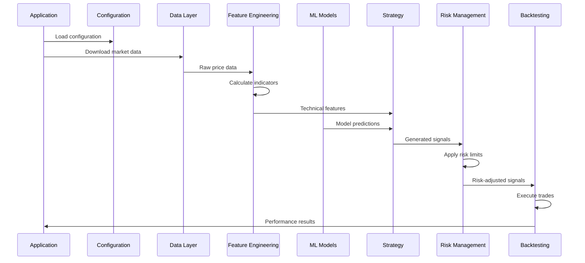

# FX-Commodity Correlation Arbitrage System Architecture

## Overview

The FX-Commodity Correlation Arbitrage system is a production-grade Python implementation designed for mean-reversion correlation/cointegration strategy between FX and commodities. The system follows a modular, layered architecture with clear separation of concerns.

## System Architecture Diagram

```mermaid
graph TB
    subgraph "Configuration Layer"
        Config[core/config.py]
    end
    
    subgraph "Data Layer"
        YahooLoader[data/yahoo_loader.py]
        EIALoader[data/eia_api.py]
    end
    
    subgraph "Feature Engineering Layer"
        Indicators[features/indicators.py]
        Spread[features/spread.py]
        Regime[features/regime.py]
        Cointegration[features/cointegration.py]
        SignalOpt[features/signal_optimization.py]
        Diagnostics[features/diagnostics.py]
    end
    
    subgraph "Machine Learning Layer"
        Ensemble[ml/ensemble.py]
        MLDiag[ml/diagnostics.py]
        Filter[ml/filter.py]
    end
    
    subgraph "Strategy Layer"
        MeanReversion[strategy/mean_reversion.py]
    end
    
    subgraph "Risk Management Layer"
        RiskManager[risk/manager.py]
        StressTest[risk/stress_test.py]
    end
    
    subgraph "Execution Layer"
        ExecPolicy[exec/policy.py]
        BrokerStub[exec/broker_stub.py]
    end
    
    subgraph "Backtesting Layer"
        Engine[backtest/engine.py]
        Parallel[backtest/parallel.py]
        RollingMetrics[backtest/rolling_metrics.py]
        DistAnalysis[backtest/distribution_analysis.py]
    end
    
    subgraph "Utilities Layer"
        Logging[utils/logging.py]
    end
    
    subgraph "Application Layer"
        RunBacktest[run_backtest.py]
    end
    
    %% Configuration flows to all layers
    Config --> MeanReversion
    Config --> RiskManager
    Config --> Engine
    
    %% Data flows
    YahooLoader --> Indicators
    YahooLoader --> Spread
    YahooLoader --> Regime
    EIALoader --> Indicators
    
    %% Feature engineering flows
    Indicators --> SignalOpt
    Spread --> SignalOpt
    Indicators --> MeanReversion
    Spread --> MeanReversion
    Regime --> MeanReversion
    
    %% ML flows
    Ensemble --> MeanReversion
    MLDiag --> Ensemble
    
    %% Strategy flows
    MeanReversion --> Engine
    
    %% Risk flows
    RiskManager --> Engine
    StressTest --> RiskManager
    
    %% Execution flows
    ExecPolicy --> Engine
    
    %% Backtest flows
    Engine --> Parallel
    RollingMetrics --> Engine
    DistAnalysis --> Engine
    
    %% Application flows
    RunBacktest --> Config
    RunBacktest --> YahooLoader
    RunBacktest --> MeanReversion
    RunBacktest --> Engine
    
    %% Utilities flows
    Logging --> Config
    Logging --> YahooLoader
    Logging --> MeanReversion
    Logging --> Engine
    Logging --> RiskManager
```



## Module Dependencies Analysis

### Current Dependency Structure

Based on the analysis of import statements, the current dependencies are:

**Core Dependencies (Bottom-up)**:
1. **Configuration Layer**: `core/config.py` - No internal dependencies
2. **Utilities Layer**: `utils/logging.py` - No internal dependencies  
3. **Data Layer**: `data/` modules - No internal dependencies
4. **Feature Engineering Layer**: `features/` modules - Import from each other
5. **ML Layer**: `ml/` modules - Import from features
6. **Strategy Layer**: Imports from features and ML
7. **Risk/Execution Layers**: Independent of strategy
8. **Backtesting Layer**: Imports from strategy, risk, and execution
9. **Application Layer**: Orchestrates all layers

### Identified Architecture Issues

#### 1. **Tight Coupling Issues** ⚠️

**Issue**: `backtest/engine.py` imports private function `_prepare_features_for_model` from `strategy/mean_reversion.py`
```python
from src.strategy.mean_reversion import _prepare_features_for_model  # ❌ Private function import
```

**Impact**: Violates encapsulation principle and creates tight coupling
**Recommendation**: Move shared feature preparation to a dedicated utility module or make it public

#### 2. **Cross-Layer Dependencies** ⚠️

**Issue**: Multiple modules importing from `ml/ensemble.py` creates dependency triangles
```python
# strategy/mean_reversion.py
from src.ml.ensemble import create_ensemble_model, ModelConfig

# backtest/engine.py  
from src.ml.ensemble import create_ensemble_model, ModelConfig

# backtest/parallel.py
from src.ml.ensemble import create_ensemble_model, ModelConfig
```

**Impact**: Potential maintenance complexity
**Recommendation**: Consider dependency injection pattern

#### 3. **No Circular Dependencies Detected** ✅

The analysis confirms no true circular import dependencies exist. The dependency flow follows proper layered architecture.

## Data Flow Architecture



## Module Responsibilities

### Core Modules

| Module | Responsibility | Dependencies |
|--------|---------------|--------------|
| `core/config.py` | Configuration management and validation | None |
| `utils/logging.py` | Centralized logging setup and utilities | None |

### Data Layer

| Module | Responsibility | Dependencies |
|--------|---------------|--------------|
| `data/yahoo_loader.py` | Yahoo Finance data download and alignment | None |
| `data/eia_api.py` | EIA API data loading (stub) | None |

### Feature Engineering Layer

| Module | Responsibility | Dependencies |
|--------|---------------|--------------|
| `features/indicators.py` | Technical indicators (z-score, ATR, correlation) | None |
| `features/cointegration.py` | Cointegration analysis (ADF, OU half-life) | None |
| `features/spread.py` | Spread calculation (OLS/RLS) | None |
| `features/regime.py` | Market regime detection and filtering | indicators.py |
| `features/signal_optimization.py` | Signal optimization and enhancement | indicators.py, spread.py |
| `features/diagnostics.py` | Feature diagnostic utilities | indicators.py |

### Machine Learning Layer

| Module | Responsibility | Dependencies |
|--------|---------------|--------------|
| `ml/ensemble.py` | Multi-model ensemble framework | None |
| `ml/diagnostics.py` | ML model diagnostics | ensemble.py |
| `ml/filter.py` | ML signal filtering (stub) | None |

### Strategy Layer  

| Module | Responsibility | Dependencies |
|--------|---------------|--------------|
| `strategy/mean_reversion.py` | Signal generation and position sizing | features/*, ml/ensemble.py |

### Risk Management Layer

| Module | Responsibility | Dependencies |
|--------|---------------|--------------|
| `risk/manager.py` | Risk limits and position sizing | None |
| `risk/stress_test.py` | Risk stress testing utilities | manager.py |

### Execution Layer

| Module | Responsibility | Dependencies |
|--------|---------------|--------------|
| `exec/policy.py` | Slippage models and execution costs | None |
| `exec/broker_stub.py` | Broker adapters (IB/OANDA stubs) | None |

### Backtesting Layer

| Module | Responsibility | Dependencies |
|--------|---------------|--------------|
| `backtest/engine.py` | Core backtesting engine with performance metrics | strategy/*, risk/*, exec/* |
| `backtest/parallel.py` | Parallel backtesting capabilities | engine.py, strategy/*, ml/* |
| `backtest/rolling_metrics.py` | Rolling performance calculations | None |
| `backtest/distribution_analysis.py` | Trade return distribution analysis | None |

## Interface Standards

### Function Signature Patterns

**Data Loading Functions**:
```python
def load_data(symbol: str, start: str, end: str) -> pd.Series
```

**Feature Calculation Functions**:
```python
def calculate_feature(series: pd.Series, window: int, **kwargs) -> pd.Series
```

**Signal Generation Functions**:
```python
def generate_signals(fx_series: pd.Series, comd_series: pd.Series, config: Dict) -> pd.DataFrame
```

**Backtesting Functions**:
```python
def run_backtest(signals_df: pd.DataFrame, config: Dict) -> Tuple[pd.DataFrame, Dict]
```

## Configuration Architecture

The system uses a centralized configuration approach with YAML files:

```yaml
# configs/pairs.yaml structure
pair_name:
  # Symbol definitions
  fx_symbol: str
  comd_symbol: str
  
  # Calculation windows
  lookbacks:
    beta_window: int
    z_window: int
    corr_window: int
  
  # Trading thresholds  
  thresholds:
    entry_z: float
    exit_z: float
    stop_z: float
  
  # Risk management
  risk:
    max_position_size: float
    max_daily_loss: float
```

## Error Handling Architecture

The system implements consistent error handling patterns:

1. **Input Validation**: All public functions validate inputs and raise `ValueError` for invalid parameters
2. **Logging Integration**: All errors are logged with context using loguru
3. **Graceful Degradation**: Functions provide fallback behavior where appropriate
4. **Exception Propagation**: Exceptions are properly propagated with context

## Performance Considerations

### Identified Bottlenecks

1. **Signal Generation**: Rolling calculations in `features/spread.py` and `strategy/mean_reversion.py`
2. **Backtesting Engine**: Position sizing calculations and PnL computation loops
3. **Data Loading**: Multiple Yahoo Finance API calls without caching
4. **ML Ensemble**: Model training and prediction overhead

### Optimization Opportunities

1. **Vectorization**: Replace loops with vectorized pandas operations
2. **Caching**: Implement data caching for repeated calculations
3. **Parallel Processing**: Leverage parallel backtesting capabilities
4. **Memory Management**: Optimize DataFrame operations for large datasets

## Deployment Architecture

The system supports multiple deployment patterns:

1. **Local Development**: Direct Python execution with virtual environment
2. **Production Backtesting**: Containerized execution with resource limits
3. **Live Trading**: Integration with broker APIs through execution layer
4. **Distributed Computing**: Parallel processing across multiple nodes

## Security Considerations

1. **API Keys**: Secure storage of broker and data provider credentials
2. **Configuration**: Sensitive parameters isolated from code
3. **Logging**: No sensitive data in log outputs
4. **Access Control**: Proper file permissions for configuration files

## Extensibility Framework

The modular architecture supports extensions:

1. **New Data Sources**: Implement data loader interface
2. **Additional Features**: Add modules to features layer
3. **ML Models**: Extend ensemble framework
4. **Brokers**: Implement execution interface
5. **Strategies**: Create new strategy modules following established patterns

## Quality Assurance

1. **Type Hints**: Comprehensive type annotations throughout
2. **Documentation**: Docstrings for all public functions
3. **Logging**: Structured logging at appropriate levels
4. **Error Handling**: Consistent exception patterns
5. **Testing**: Framework ready for comprehensive test coverage

## Future Architecture Improvements

1. **Dependency Injection**: Implement IoC container for better testability
2. **Event-Driven Architecture**: Publish/subscribe patterns for real-time data
3. **Microservices**: Split into independent services for scale
4. **Database Integration**: Persistent storage for historical data and results
5. **API Layer**: REST/GraphQL API for external integration