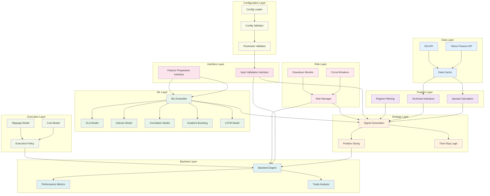
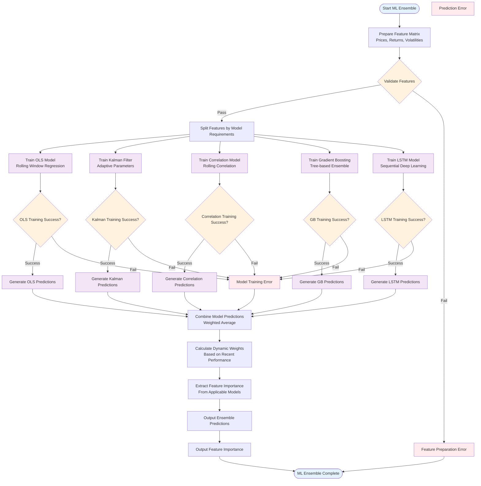
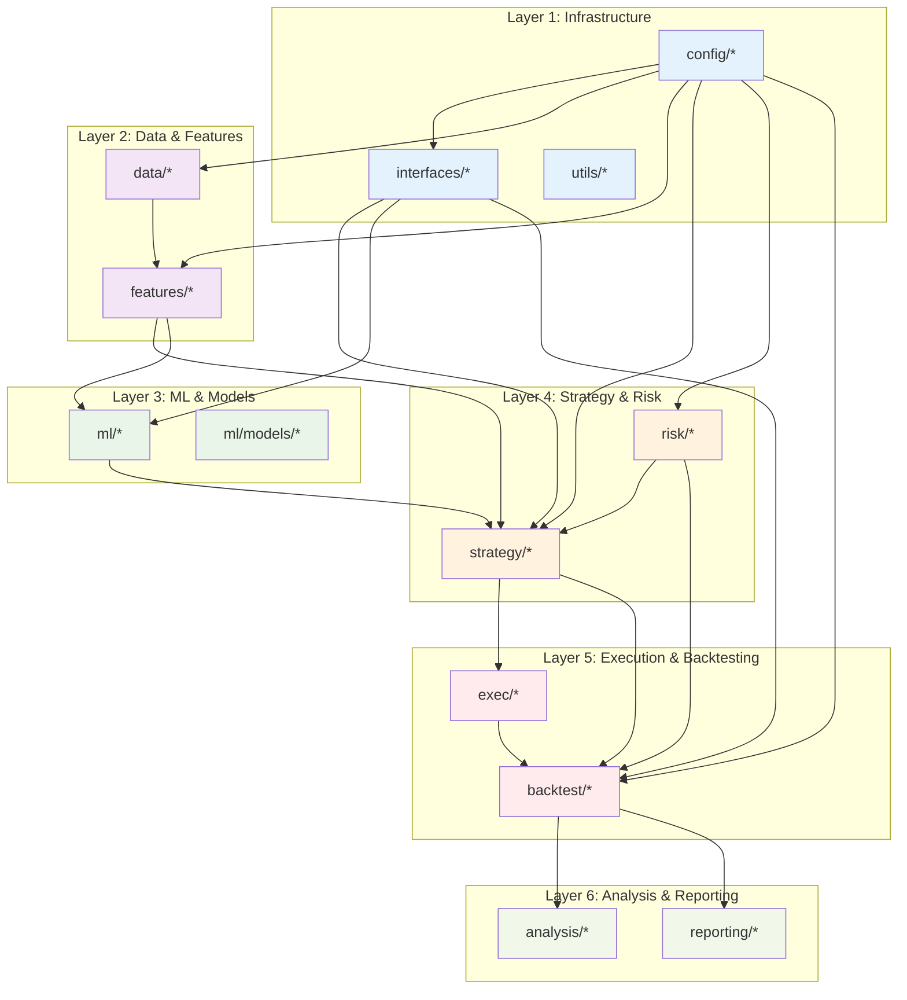
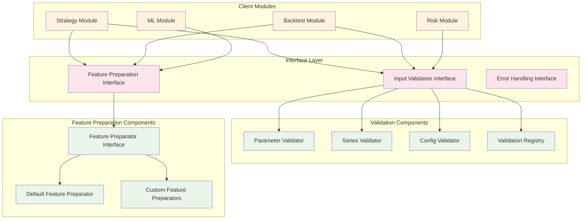

# FX-Commodity Correlation Arbitrage System - Flow Diagrams

## Overview

This document provides detailed system flow diagrams showing the module relationships and data flow after architectural improvements. These diagrams illustrate the clean separation of concerns and reduced coupling achieved through the refactoring process.

## 1. High-Level System Architecture



## 2. Signal Generation Flow

```mermaid
graph TD
    Start([Start Signal Generation])
    
    %% Input Validation
    ValidateInputs{Validate Inputs}
    ValidateConfig{Validate Config}
    ValidateSeries{Validate Series Alignment}
    
    %% Data Preparation
    PrepareData[Prepare Market Data]
    CalculateSpread[Calculate Spread<br/>OLS/Kalman/RLS]
    CalculateIndicators[Calculate Technical Indicators<br/>Z-Score, ATR, etc.]
    
    %% Regime Filtering
    RegimeAnalysis[Regime Analysis]
    CorrelationGate[Correlation Gate]
    StationarityTest[ADF Stationarity Test]
    CombineRegime[Combine Regime Filters]
    
    %% ML Enhancement
    DecisionML{Use ML Models?}
    PrepareFeatures[Prepare ML Features]
    RunEnsemble[Run Ensemble Models]
    CombinePredictions[Combine ML Predictions]
    
    %% Signal Logic
    CalculateZScore[Calculate Z-Score Signals]
    ApplyThresholds[Apply Entry/Exit Thresholds]
    PositionLogic[Apply Position Logic]
    TimeStopCheck[Apply Time Stop Logic]
    
    %% Risk Checks
    RiskCheck{Risk Limits OK?}
    ApplyRiskLimits[Apply Risk Limits]
    
    %% Output
    GeneratePositions[Generate Position Sizes]
    OutputSignals[Output Signal DataFrame]
    End([Signal Generation Complete])
    
    %% Error Handling
    ValidationError[Log Validation Error]
    ConfigError[Log Config Error]
    MLError[Log ML Error]
    RiskError[Log Risk Error]
    
    %% Flow connections
    Start --> ValidateInputs
    ValidateInputs -->|Pass| ValidateConfig
    ValidateInputs -->|Fail| ValidationError
    ValidateConfig -->|Pass| ValidateSeries
    ValidateConfig -->|Fail| ConfigError
    ValidateSeries -->|Pass| PrepareData
    ValidateSeries -->|Fail| ValidationError
    
    PrepareData --> CalculateSpread
    CalculateSpread --> CalculateIndicators
    CalculateIndicators --> RegimeAnalysis
    
    RegimeAnalysis --> CorrelationGate
    CorrelationGate --> StationarityTest
    StationarityTest --> CombineRegime
    
    CombineRegime --> DecisionML
    DecisionML -->|Yes| PrepareFeatures
    DecisionML -->|No| CalculateZScore
    PrepareFeatures --> RunEnsemble
    RunEnsemble --> CombinePredictions
    CombinePredictions -->|Success| CalculateZScore
    RunEnsemble -->|Error| MLError
    MLError --> CalculateZScore
    
    CalculateZScore --> ApplyThresholds
    ApplyThresholds --> PositionLogic
    PositionLogic --> TimeStopCheck
    TimeStopCheck --> RiskCheck
    
    RiskCheck -->|Pass| GeneratePositions
    RiskCheck -->|Fail| ApplyRiskLimits
    ApplyRiskLimits --> RiskError
    RiskError --> GeneratePositions
    
    GeneratePositions --> OutputSignals
    OutputSignals --> End
    
    ValidationError --> End
    ConfigError --> End
    
    classDef process fill:#e3f2fd
    classDef decision fill:#fff3e0
    classDef error fill:#ffebee
    classDef start fill:#e8f5e8
    
    class Start,End start
    class ValidateInputs,ValidateConfig,ValidateSeries,DecisionML,RiskCheck decision
    class ValidationError,ConfigError,MLError,RiskError error
```



## 3. Backtest Engine Flow

```mermaid
graph TD
    StartBT([Start Backtest])
    
    %% Input Processing
    ValidateDF{Validate Signals DataFrame}
    ExtractParams[Extract Config Parameters]
    InitRiskManager[Initialize Risk Manager]
    InitExecutionPolicy[Initialize Execution Policy]
    
    %% Signal Processing
    GenerateTradeSignals[Generate Trading Signals<br/>Entry/Exit/Stop]
    ApplyExecutionDelay[Apply One-Bar Execution Delay]
    
    %% PnL Calculation Loop
    StartLoop[Start Daily Processing Loop]
    CalculatePnL[Calculate Position PnL]
    CalculateExecutionCosts[Calculate Execution Costs]
    UpdateEquityCurve[Update Equity Curve]
    
    %% Risk Monitoring
    CheckDrawdown{Check Drawdown Limits}
    CheckRiskLimits{Check Position Limits}
    ApplyCircuitBreaker[Apply Circuit Breaker]
    
    %% Trade Analysis
    IdentifyTrades[Identify Individual Trades]
    CalculateTradeStats[Calculate Trade Statistics]
    CalculateReturns[Calculate Trade Returns]
    
    %% Performance Metrics
    CalculateBasicMetrics[Calculate Basic Metrics<br/>Total Return, CAGR]
    CalculateRiskMetrics[Calculate Risk Metrics<br/>Sharpe, Sortino, MaxDD]
    CalculateTradeMetrics[Calculate Trade Metrics<br/>Win Rate, Profit Factor]
    CalculateDistributionStats[Calculate Distribution Statistics<br/>Skewness, Kurtosis, VaR]
    
    %% Rolling Metrics
    DecisionRolling{Calculate Rolling Metrics?}
    CalculateRollingMetrics[Calculate Rolling Performance<br/>30/60/90 Day Windows]
    
    %% Output Generation
    GenerateReport[Generate Backtest Report]
    OutputResults[Output Results & Metrics]
    EndBT([Backtest Complete])
    
    %% Error Handling
    ValidationErrorBT[Validation Error]
    ConfigErrorBT[Config Error]
    ProcessingErrorBT[Processing Error]
    
    %% Continuation Logic
    MoreDays{More Days to Process?}
    
    %% Flow connections
    StartBT --> ValidateDF
    ValidateDF -->|Pass| ExtractParams
    ValidateDF -->|Fail| ValidationErrorBT
    ExtractParams --> InitRiskManager
    InitRiskManager --> InitExecutionPolicy
    InitExecutionPolicy --> GenerateTradeSignals
    
    GenerateTradeSignals --> ApplyExecutionDelay
    ApplyExecutionDelay --> StartLoop
    
    StartLoop --> CalculatePnL
    CalculatePnL --> CalculateExecutionCosts
    CalculateExecutionCosts --> UpdateEquityCurve
    UpdateEquityCurve --> CheckDrawdown
    
    CheckDrawdown -->|Within Limits| CheckRiskLimits
    CheckDrawdown -->|Breach| ApplyCircuitBreaker
    ApplyCircuitBreaker --> MoreDays
    
    CheckRiskLimits -->|Within Limits| MoreDays
    CheckRiskLimits -->|Breach| ApplyCircuitBreaker
    
    MoreDays -->|Yes| StartLoop
    MoreDays -->|No| IdentifyTrades
    
    IdentifyTrades --> CalculateTradeStats
    CalculateTradeStats --> CalculateReturns
    CalculateReturns --> CalculateBasicMetrics
    
    CalculateBasicMetrics --> CalculateRiskMetrics
    CalculateRiskMetrics --> CalculateTradeMetrics
    CalculateTradeMetrics --> CalculateDistributionStats
    CalculateDistributionStats --> DecisionRolling
    
    DecisionRolling -->|Yes| CalculateRollingMetrics
    DecisionRolling -->|No| GenerateReport
    CalculateRollingMetrics --> GenerateReport
    
    GenerateReport --> OutputResults
    OutputResults --> EndBT
    
    ValidationErrorBT --> EndBT
    ConfigErrorBT --> EndBT
    ProcessingErrorBT --> EndBT
    
    classDef process fill:#e3f2fd
    classDef decision fill:#fff3e0
    classDef loop fill:#f3e5f5
    classDef error fill:#ffebee
    classDef start fill:#e8f5e8
    
    class StartBT,EndBT start
    class ValidateDF,CheckDrawdown,CheckRiskLimits,MoreDays,DecisionRolling decision
    class StartLoop loop
    class ValidationErrorBT,ConfigErrorBT,ProcessingErrorBT error
```



## 4. ML Ensemble Flow



## 5. Module Dependency Graph (After Refactoring)



## 6. Interface Layer Architecture



## Key Architectural Improvements

### 1. Eliminated Tight Coupling
- **Before**: Backtest engine directly imported private functions from strategy layer
- **After**: Uses clean interface layer for feature preparation and validation

### 2. Standardized Error Handling
- **Before**: Inconsistent validation patterns across modules
- **After**: Centralized validation interface with consistent error types

### 3. Clean Layered Architecture
- Clear dependency hierarchy from infrastructure to analysis layers
- No circular dependencies between major components
- Interface layer provides abstraction between core modules

### 4. Improved Separation of Concerns
- **Data Layer**: Focuses purely on data loading and caching
- **Feature Layer**: Handles technical calculations and indicators
- **ML Layer**: Manages model training and prediction
- **Strategy Layer**: Implements trading logic and signal generation
- **Interface Layer**: Provides clean abstractions and validation
- **Execution Layer**: Handles trade execution and cost modeling
- **Backtest Layer**: Manages backtesting and performance analysis

### 5. Enhanced Modularity
- Each module has well-defined responsibilities
- Clear interfaces between modules
- Easy to test and maintain individual components
- Supports plugin architecture for extending functionality

## Usage Examples

### Using Validation Interface
```python
from src.interfaces.validation import validate_trading_config, ValidationError

try:
    validate_trading_config(config)
except ValidationError as e:
    logger.error(f"Configuration invalid: {e}")
```

### Using Feature Preparation Interface
```python
from src.interfaces.feature_preparation import prepare_features_for_model

features = prepare_features_for_model(fx_series, comd_series, config)
```

This architectural design provides a solid foundation for the FX-Commodity Correlation Arbitrage trading system with clear separation of concerns, standardized interfaces, and maintainable code structure.